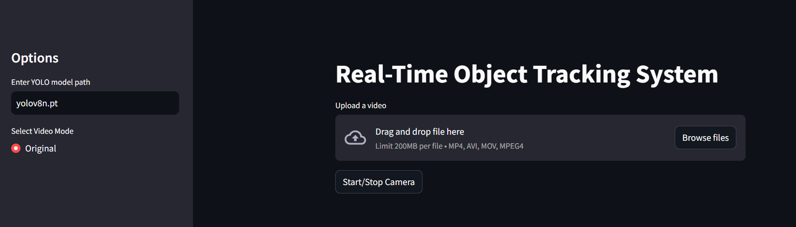
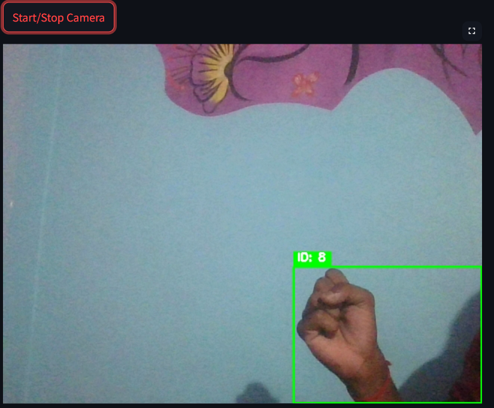

# 🎯 Real-Time Object Detection & Tracking System

This project uses **YOLOv8** and **DeepSORT** to perform real-time object detection and tracking using webcam or uploaded video files. A **Streamlit** interface allows users to interact easily with the system.

---

## 🚀 Features

- ✅ Real-time webcam object detection and tracking
- 🎥 Upload videos and process with YOLOv8 + DeepSORT
- 📦 Built-in tracking with object ID visualization
- 🧠 Custom model support (`.pt` format)
- ⚡ Simple and responsive Streamlit UI
  
---
## 🌐 Live Demo

[🔗 Click here to try the live app](https://object-detector-tracker.streamlit.app)
---

## 🧰 Tech Stack

- [Python 3.8+](https://www.python.org/)
- [YOLOv8](https://github.com/ultralytics/ultralytics)
- [DeepSORT](https://github.com/mikel-brostrom/Yolov5_DeepSort_Pytorch)
- [Streamlit](https://streamlit.io/)
- [OpenCV](https://opencv.org/)

---

## 🖼️ Screenshots

### 🔹 Home UI


### 🔹 Detecting & Tracking 



---

## 📁 Folder Structure

```
project/
├── uploads/               # Uploaded video files (ignored in Git)
├── outputs/               # Processed video output (ignored in Git)
├── assets/                # Screenshots for README
├── app.py                 # Main Streamlit application
├── requirements.txt       # Dependencies
└── README.md              # This file
```

---

## ⚙️ Installation

```bash
# 1. Clone the repository
git clone https://github.com/yourusername/real-time-object-tracker.git
cd real-time-object-tracker

# 2. Create a virtual environment
python -m venv venv
source venv/bin/activate  # For Linux/macOS
venv\Scripts\activate     # For Windows

# 3. Install dependencies
pip install -r requirements.txt
```

---

## ▶️ Running the App

```bash
streamlit run app.py
```

You can:
- Start/Stop the **camera** for real-time tracking.
- Upload a **video file** and click **Track** to process.
- Switch between original and processed video view.

---

## 📦 Requirements

Create a `requirements.txt` like this:

```txt
streamlit
opencv-python
ultralytics
deep_sort_realtime
```

---


## 📌 Notes

- Default YOLO model: `yolov8n.pt`
- You can use your own trained model by changing the path in the sidebar.
- Ensure your system has a webcam for real-time testing.

---

## 🙌 Author

Developed by **Your Name**  
📧 your.email@example.com  
🔗 [GitHub](https://github.com/yourusername)

---

## 📄 License

This project is open source and available under the [MIT License](LICENSE).
